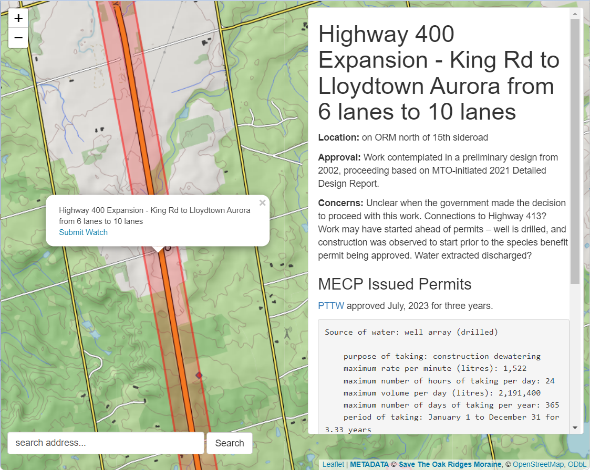
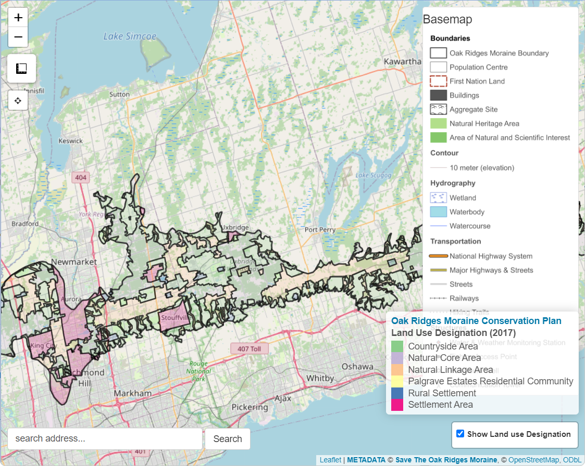
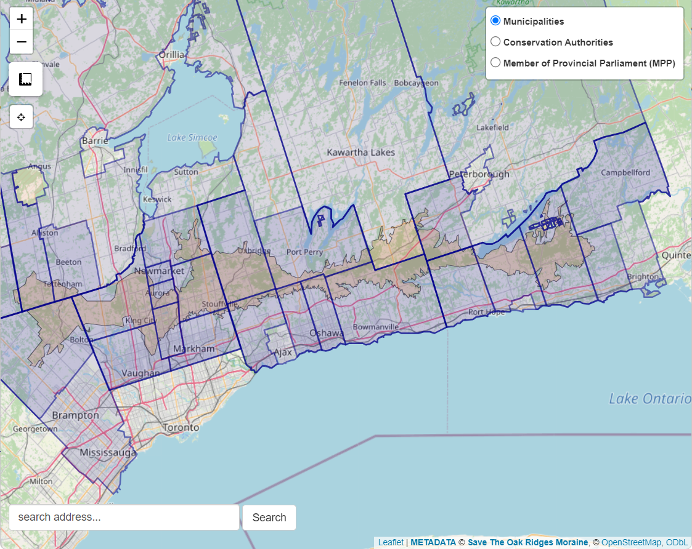
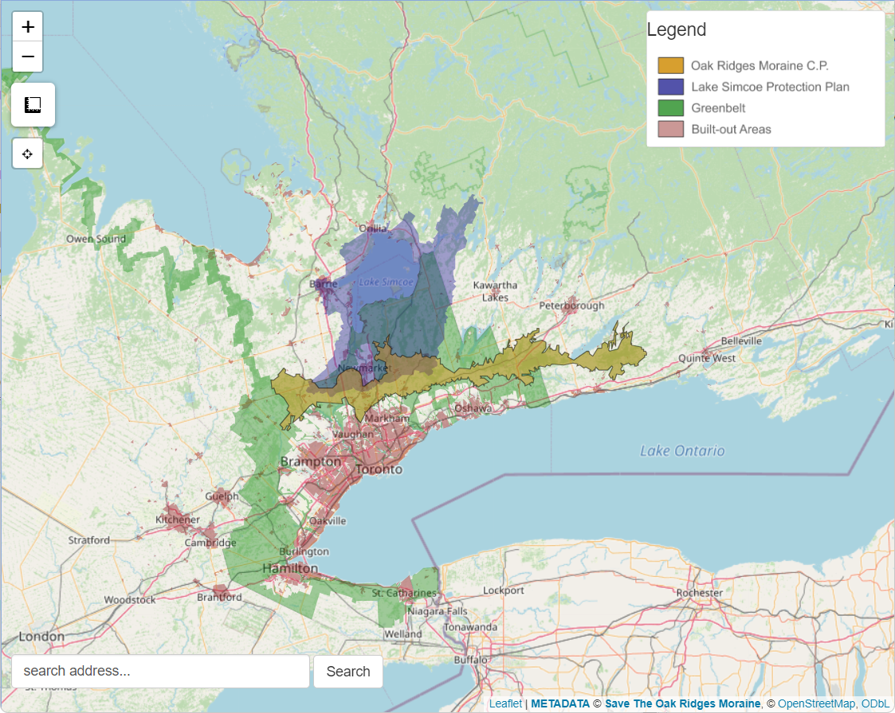

# SAVE THE OAK RIDGES MORAINE

The Save The Oak Ridges Moraine (**STORM**) Coalition has focused on protecting the ecological integrity of the Oak Ridges Moraine since 1989.

To accompany our website ([stormcoalition.com](https://www.stormcoalition.com/)). This repository holds STORM's *"[GitHub Pages](https://pages.github.com/)"* where ideas, knowledge, references, mapping and technology are shared openly.

# MAPS

STORM has invested much time in creating interactive online mapping tools to help inform and educate the public on the many functions the Oak Ridges Moraine has to offer and the legislative protections in place that are meant to protect this land. These maps also serve as a means to coordinate insights and knowledge brought to STORM through the engagement of our members and concerned citizens abroad. These maps are organic in that they are intended to update continuously--thus enabling a platform for communication and spreading awareness focussed on the moraine.

We encourage any and all feedback, whether it's training on how to use the tools and/or features one wished to have added. STORM's mission here is to re-invigorate community engagement toward the protection of the Oak Ridges Moraine.

*Data sources used for the maps are [**provided below**](#data-sources)*

### [Moraine Watch map](https://stormcoalition.shinyapps.io/morainewatch/)

This is the home mapping tool designed to assist the **Moraine Watch** program.  The intention of this map is to provide many interactive resources to concerned citizens who are concerned with land use changes occurring atop the Oak Ridges Moraine.

 

### [Oak Ridges Moraine Conservation Plan map](https://stormcoalition.shinyapps.io/ormca/)

The Oak Ridges Moraine Conservation Plan map presents the land use designation as defined by the 2017 plan.

 

### [Jurisdiction](https://stormcoalition.shinyapps.io/jurisdiction/)

The jurisdiction map shows all the public agencies that share some part of the Oak Ridges Moraine. This includes:

- Municipalities (both upper and lower tiers)
- Conservation Authorities
- Provincial Ridings

 

### [Policy](https://stormcoalition.shinyapps.io/policy/)

The policy map shows all the public agencies that share some part of the Oak Ridges Moraine. This includes:

- [Oak Ridges Moraine Conservation Plan (2017)](https://files.ontario.ca/oak-ridges-moraine-conservation-plan-2017.pdf)
- [Niagara Escarpment Plan (2017)](https://escarpment.org/wp-content/uploads/2021/05/NEP-Consolidation-April-5-2021-FINAL.pdf)
- [Greenbelt Plan (2017)](https://files.ontario.ca/greenbelt-plan-2017-en.pdf)
- [Lake Simcoe Protection Plan (2009)](https://rescuelakesimcoe.org/wp-content/uploads/2021/02/Lake-Simcoe-Protection-Plan.pdf)

 

### [Natural Resources](https://stormcoalition.shinyapps.io/resources/)

The natural resource map shows a multitude of resource extraction and agricultural activities on the Oak Ridges Moraine such as active and inactive aggregate operations occurring in the Oak Ridges Moraine area.

 

## Map Features

1. Custom ORM "basemap": provides specialized geographic details needed to determine local features at risk.
1. Geo-locator: let your devices' GPS identify your location.
1. Address locator: discover a location by entering an address.
1. Measurement tool: determine either lengths or areas by clicking on the interactive maps.
1. click anywhere to gather coordinates and provide pre-filled emails for Moraine Watchers to submit a actions of concern. 

 

<!-- <iframe src="https://raw.githubusercontent.com/stormcoalition/shinyapps.io/main/ORMbasemap/ORMbasemap.html" width="100%" height="400" scrolling="no" allowfullscreen></iframe>

*STORM basemap layer*

  -->

# MORE INFO

## OAK RIDGES MORAINE

The Oak Ridges Moraine is one of Ontario's largest moraines, it extends 160 kilometres from the Niagara Escarpment in the west to the Trent River system in the east, and is on average 13 kilometres wide. 

## HISTORY

The idea for a coalition on the Oak Ridges Moraine flowed out of a meeting in October 1989 of community-based groups and individuals concerned about development pressures in different areas of the Oak Ridges Moraine.

## PARTNER ORGANIZATIONS AND RESOURCE MATERIAL

Information on our moraine partners and extensive resource library including government documents and various studies completed by STORM and others.

<!--  

### Acknowledgements

 -->

 

## Data sources

All geospatial data hosted on STORM's maps come from open federal, provincial and municipal data repositories. All data are freely available and are referenced in detail on our [**Map data sources**](sources.html) page.

STORM strives to maintain an open and transparent access to the data we post online. Any data sets either produced by us or derived from external public data sets are hosted on GitHub [**here**](https://github.com/stormcoalition/geojson). These data are free to use under the Creative Commons [CC-BY-SA-4.0 license](https://creativecommons.org/licenses/by-sa/4.0/deed.en).

