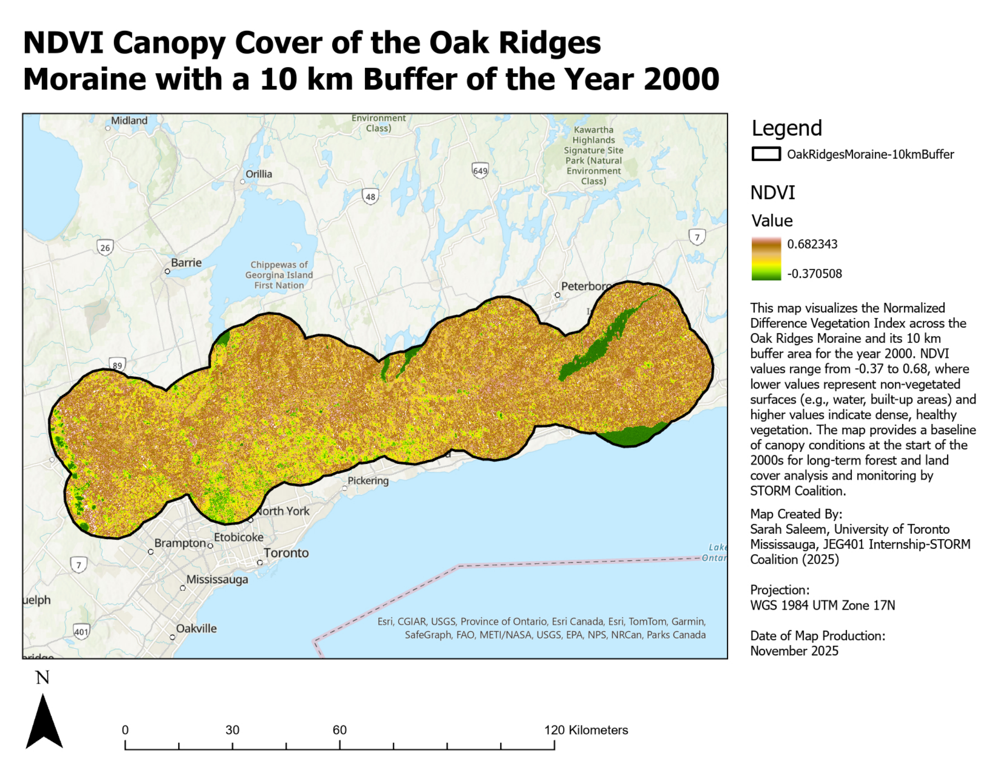
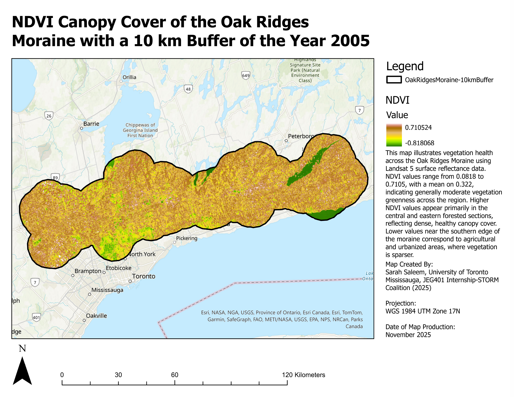
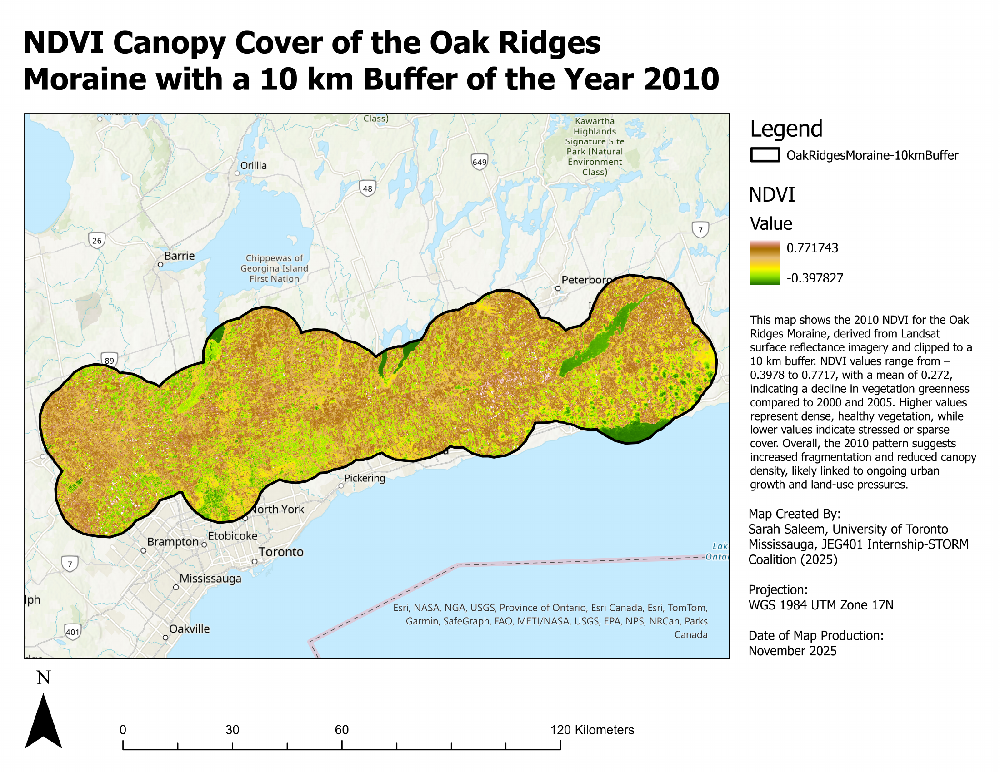
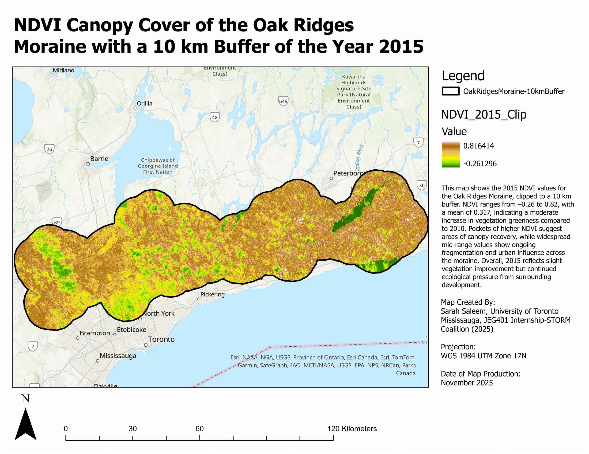
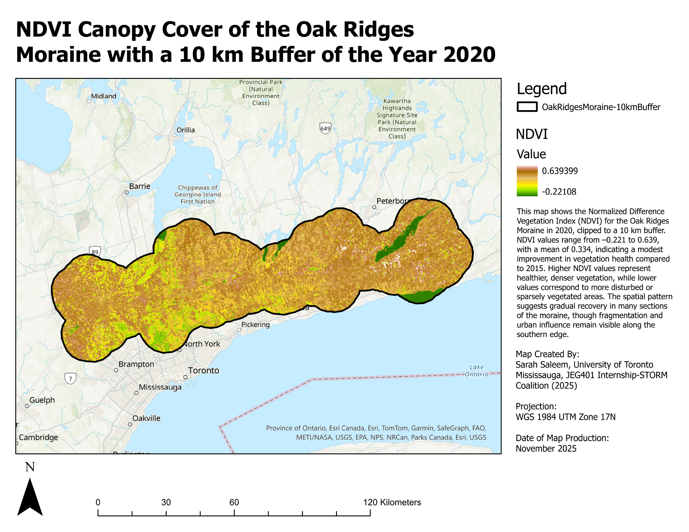

# Canopy Tracking on The Oak Ridges Moraine

A 25-year longitudinal analysis of canopy cover across the Oak Ridges Moraine, based on historical satellite imagery, reveals how forest canopy extent and continuity have changed over time. Through this work, STORM offers a clear and accessible look at what publicly available data show about the Moraine's evolving landscape and how these insights can support more informed conservation and land-use decisions in the years ahead.

> Analysis prepared by: Sarah Saleem, University of Toronto Mississauga, JEG401 Internship-STORM Coalition (November, 2005).

## Normalized Difference Vegetation Index

The normalized difference vegetation index (NDVI) is a common measure of vegetation health and density using satellite data. It works by comparing red and near-infrared light, which together provide indicator of plant growth.

$$
    \text{NDVI}=\frac{\text{NIR}-\text{Red}}{\text{NIR}+\text{Red}}
$$

where
- $\text{NIR}$: near infrared light (very reflective off leafy material)
- $\text{Red}$: red spectrum (absorbed for photosynthesis)

NDVI values range from $-1\text{ to}1$, and any value above zero generally increases with the amount of vegetation present.

 

> TOP: Estimated absorption spectra of chlorophyll a, chlorophyll b, and carotenoids within chloroplasts. BOTTOM: The action spectrum of photosynthesis (oxygen evolution per incident photon) peaks at the same wavelengths where chlorophyll a and b absorb light, demonstrating that the energy these pigments capture directly drives photosynthesis. (John Whitmarsh and Govindjee. http://www.life.uiuc.edu/govindjee/paper/gov.html, from "Concepts in Photobiology: Photosynthesis and Photomorphogenesis", Edited by GS Singhal, G Renger, SK Sopory, K-D Irrgang and Govindjee, Narosa Publishers/New Delhi; and Kluwer Academic/Dordrecht, pp. 11-51. From unpublished data.).

 

## Vegetation cover on the Oak Ridges Moraine

NDVI is calculated during the summer months (centered on July) to capture canopy conditions when leaf growth is at its peak. NDVI values were generated for the summers of 2000, 2005, 2010, 2015, 2020, and 2025.

